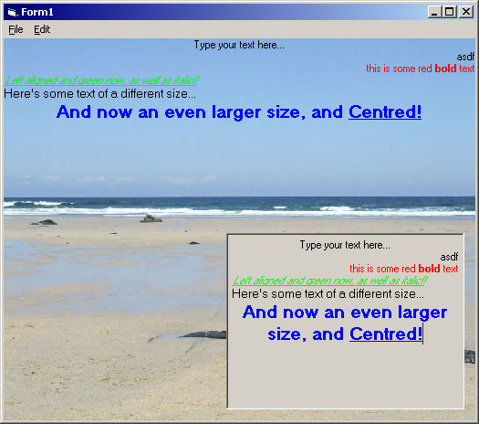



## Render rich text to any device context\!

### Description

Recently I found myself wanting more than what DrawText could offer: I wanted to be able to render rich text. Rather than write a function for this myself, I wondered whether I could accomplish this with a RichTextBox, and quite simply in fact. Unfortunately it doesn't render text transparently usually. Unless, that is, you set the WS_EX_TRANSPARENT style, at which point it does render transparently, giving you unlimited text drawing power! Note that the method used to get the RichTextBox to actually draw the text (that is sending it EM_FORMATRANGE) can also be used to measure the text with a slight modification (MSDN will tell you how).
 
### More Info
 

             |
---                |---
**Submitted On**   |2006-06-02 12:00:02
**By**             |[William Keith](https://github.com/Planet-Source-Code/PSCIndex/blob/master/ByAuthor/william-keith.md)
**Level**          |Advanced
**User Rating**    |5.0 (10 globes from 2 users)
**Compatibility**  |VB 5\.0, VB 6\.0
**Category**       |[Graphics](https://github.com/Planet-Source-Code/PSCIndex/blob/master/ByCategory/graphics__1-46.md)
**World**          |[Visual Basic](https://github.com/Planet-Source-Code/PSCIndex/blob/master/ByWorld/visual-basic.md)
**Archive File**   |[Render\_ric199821622006\.zip](https://github.com/Planet-Source-Code/william-keith-render-rich-text-to-any-device-context__1-65546/archive/master.zip)

### API Declarations

Quite a few.

